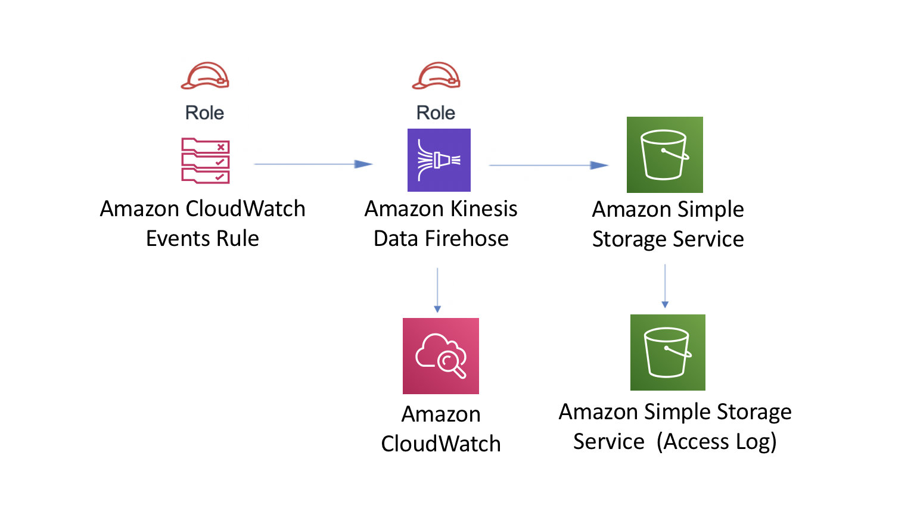

# aws-events-rule-kinesisfirehose-s3 module
<!--BEGIN STABILITY BANNER-->

---


> All classes are under active development and subject to non-backward compatible changes or removal in any
> future version. These are not subject to the [Semantic Versioning](https://semver.org/) model.
> This means that while you may use them, you may need to update your source code when upgrading to a newer version of this package.

---
<!--END STABILITY BANNER-->

| **Reference Documentation**:| <span style="font-weight: normal">https://docs.aws.amazon.com/solutions/latest/constructs/</span>|
|:-------------|:-------------|
<div style="height:8px"></div>

| **Language**     | **Package**        |
|:-------------|-----------------|
| Python|`aws_solutions_constructs.aws_events_rule_kinesisfirehose_s3`|
| Typescript|`@aws-solutions-constructs/aws-events-rule-kinesisfirehose-s3`|
| Java|`software.amazon.awsconstructs.services.eventsrulekinesisfirehoses3`|

This AWS Solutions Construct implements an Amazon CloudWatch Events rule to send data to an Amazon Kinesis Data Firehose delivery stream connected to an Amazon S3 bucket.

Here is a minimal deployable pattern definition in Typescript:

``` javascript
const { EventsRuleToKinesisFirehoseToS3, EventsRuleToKinesisFirehoseToS3Props } from '@aws-solutions-constructs/aws-events-rule-kinesisfirehose-s3';

const props: EventsRuleToKinesisFirehoseToS3Props = {
    eventRuleProps: {
    description: 'event rule props',
    schedule: events.Schedule.rate(cdk.Duration.minutes(5))
};

new EventsRuleToKinesisFirehoseToS3(this, 'test-events-rule-firehose-s3', props);

```

## Initializer

``` text
new EventsRuleToKinesisFirehoseToS3(scope: Construct, id: string, props: EventsRuleToKinesisFirehoseToS3Props);
```

_Parameters_

* scope [`Construct`](https://docs.aws.amazon.com/cdk/api/latest/docs/@aws-cdk_core.Construct.html)
* id `string`
* props [`EventsRuleToKinesisFirehoseToS3Props`](#pattern-construct-props)

## Pattern Construct Props

| **Name**     | **Type**        | **Description** |
|:-------------|:----------------|-----------------|
|eventRuleProps|[`events.RuleProps`](https://docs.aws.amazon.com/cdk/api/latest/docs/@aws-cdk_aws-events.RuleProps.html)|User provided eventRuleProps to override the defaults.|
|kinesisFirehoseProps?|[`kinesisfirehose.CfnDeliveryStreamProps`](https://docs.aws.amazon.com/cdk/api/latest/docs/@aws-cdk_aws-kinesisfirehose.CfnDeliveryStreamProps.html)|Optional user provided props to override the default props for Kinesis Firehose Delivery Stream|
|existingBucketObj?|[`s3.IBucket`](https://docs.aws.amazon.com/cdk/api/latest/docs/@aws-cdk_aws-s3.IBucket.html)|Existing instance of S3 Bucket object, if this is set then the bucketProps is ignored.|
|bucketProps?|[`s3.BucketProps`](https://docs.aws.amazon.com/cdk/api/latest/docs/@aws-cdk_aws-s3.BucketProps.html)|User provided props to override the default props for the S3 Bucket.|

## Pattern Properties

| **Name**     | **Type**        | **Description** |
|:-------------|:----------------|-----------------|
|eventsRule|[`events.Rule`](https://docs.aws.amazon.com/cdk/api/latest/docs/@aws-cdk_aws-events.Rule.html)|Returns an instance of events.Rule created by the construct.|
|kinesisFirehose|[`kinesisfirehose.CfnDeliveryStream`](https://docs.aws.amazon.com/cdk/api/latest/docs/@aws-cdk_aws-kinesisfirehose.CfnDeliveryStream.html)|Returns an instance of kinesisfirehose.CfnDeliveryStream created by the construct|
|s3Bucket?|[`s3.Bucket`](https://docs.aws.amazon.com/cdk/api/latest/docs/@aws-cdk_aws-s3.Bucket.html)|Returns an instance of s3.Bucket created by the construct|
|s3LoggingBucket?|[`s3.Bucket`](https://docs.aws.amazon.com/cdk/api/latest/docs/@aws-cdk_aws-s3.Bucket.html)|Returns an instance of s3.Bucket created by the construct as the logging bucket for the primary bucket.|
|eventsRole|[`iam.Role`](https://docs.aws.amazon.com/cdk/api/latest/docs/@aws-cdk_aws-iam.Role.html)|Returns an instance of the iam.Role created by the construct for Events Rule|
|kinesisFirehoseRole|[`iam.Role`](https://docs.aws.amazon.com/cdk/api/latest/docs/@aws-cdk_aws-iam.Role.html)|Returns an instance of the iam.Role created by the construct for Kinesis Data Firehose delivery stream|
|kinesisFirehoseLogGroup|[`logs.LogGroup`](https://docs.aws.amazon.com/cdk/api/latest/docs/@aws-cdk_aws-logs.LogGroup.html)|Returns an instance of the LogGroup created by the construct for Kinesis Data Firehose delivery stream|
|firehoseToS3|[`aws_solutions_constructs.aws-kinesisfirehose-s3`](https://docs.aws.amazon.com/solutions/latest/constructs/aws-kinesisfirehose-s3.html)|Returns an instance of aws-kinesisfirehose-s3 construct created by the construct|

## Default settings

Out of the box implementation of the Construct without any override will set the following defaults:

### Amazon CloudWatch Events Rule
* Configure least privilege access IAM role for Events Rule to publish to the Kinesis Firehose Delivery Stream.

### Amazon Kinesis Firehose
* Enable CloudWatch logging for Kinesis Firehose
* Configure least privilege access IAM role for Amazon Kinesis Firehose

### Amazon S3 Bucket
* Configure Access logging for S3 Bucket
* Enable server-side encryption for S3 Bucket using AWS managed KMS Key
* Turn on the versioning for S3 Bucket
* Don't allow public access for S3 Bucket
* Retain the S3 Bucket when deleting the CloudFormation stack
* Applies Lifecycle rule to move noncurrent object versions to Glacier storage after 90 days

## Architecture


***
&copy; Copyright 2020 Amazon.com, Inc. or its affiliates. All Rights Reserved.